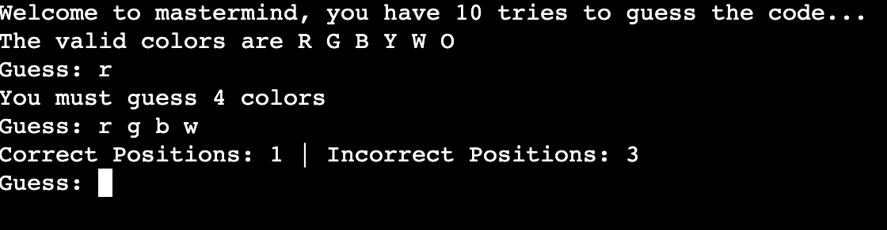

## Preview 




#  Mastermind Game in Python

A command-line implementation of the classic **Mastermind** game built entirely in Python. In this game, the computer generates a secret sequence of colors, and the player has a limited number of attempts to guess the correct combination.

After each guess, the program provides feedback indicating:

-  How many colors are in the correct position.
-  How many correct colors are present but placed in the wrong position.

This project demonstrates fundamental programming concepts including functions, loops, dictionaries, lists, conditional logic, user input validation, and basic game development.

---

##  Features

- Randomly generates a secret color code.
- Six possible colors:
  - **R** – Red
  - **G** – Green
  - **B** – Blue
  - **Y** – Yellow
  - **W** – White
  - **O** – Orange
- Four-color secret code.
- Ten attempts to guess the code.
- Input validation to prevent invalid guesses.
- Feedback after every guess.
- Displays the correct solution if all attempts are exhausted.

---

##  Project Structure

```
mastermind.py
README.md
```

---

## How the Game Works

1. The computer randomly generates a secret code consisting of four colors.
2. The player has **10 attempts** to guess the sequence.
3. After each guess, the program evaluates the answer and returns:
   - Number of colors in the correct position.
   - Number of correct colors placed in the wrong position.
4. The game continues until:
   - The player guesses the entire code correctly, or
   - All attempts have been used.

---

##  Technologies Used

- Python 3
- `random` module

---

##  Python Concepts Demonstrated

This project demonstrates several important Python concepts:

- Functions
- Lists
- Dictionaries
- Loops (`for`, `while`)
- Conditional statements
- User input validation
- Random number generation
- List iteration
- `zip()` function
- Dictionary counting
- Boolean logic

---

#  Game Rules

The secret code consists of **4 colors**.

Possible colors are:

```
R G B Y W O
```

Example guess:

```
R G B Y
```

After every guess, the game provides feedback such as:

```
Correct Positions: 2
Incorrect Positions: 1
```

This means:

- Two colors are exactly correct.
- One additional color exists in the secret code but is in the wrong position.

---

# Program Workflow

```
Start

↓

Generate Random Secret Code

↓

Display Available Colors

↓

Player Enters Guess

↓

Validate Input

↓

Compare Guess with Secret Code

↓

Count:
• Correct positions
• Correct colors in wrong positions

↓

Display Feedback

↓

Code Correct?
      │
 Yes ─────► Win
      │
 No
      │
Attempts Remaining?
      │
 Yes ─────► Guess Again
      │
 No
      │
Show Secret Code

↓

End
```

---

# Code Overview

## 1. Generate the Secret Code

The program randomly selects four colors from the available list.

Example:

```
Secret Code:

R B Y G
```

The player never sees this code while playing.

---

## 2. User Input

The player enters four colors separated by spaces.

Example:

```
Guess:
R G B Y
```

The input is automatically converted to uppercase.

---

## 3. Input Validation

Before checking the answer, the program verifies:

- Exactly four colors were entered.
- Every color belongs to the allowed list.

If not, the player is asked to try again.

---

## 4. Comparing the Guess

The program compares the player's guess with the secret code in two stages.

### Step 1

Find colors that are already in the correct position.

Example

Secret

```
R G B Y
```

Guess

```
R B G Y
```

Correct positions:

```
R
Y
```

Result

```
Correct Positions = 2
```

---

### Step 2

Check remaining colors that exist in the code but appear in the wrong position.

Remaining:

```
Secret

G B

Guess

B G
```

Both colors exist but are swapped.

Result

```
Incorrect Positions = 2
```

---

## Sample Gameplay

```
Welcome to Mastermind!

The valid colors are:

R G B Y W O

Guess:
R G B Y

Correct Positions: 1
Incorrect Positions: 2

Guess:
R B G W

Correct Positions: 3
Incorrect Positions: 0

Guess:
R B G Y

You guessed the code in 3 tries!
```

---

## Example Losing Game

```
Welcome to Mastermind!

...

You ran out of tries.

The code was:

R Y G O
```

---

# Time Complexity

Let:

- **n = CODE_LENGTH**

Each guess compares every color only a few times.

Overall complexity:

```
O(n)
```

Since the code length is fixed at 4, the program runs almost instantly.

---

# Space Complexity

The program stores:

- Secret code
- Player guess
- Color frequency dictionary

Overall complexity:

```
O(n)
```

---

# Advantages

- Beginner-friendly implementation.
- Easy to understand and modify.
- Demonstrates multiple Python fundamentals.
- Includes proper input validation.
- Uses dictionaries for efficient color counting.
- Recreates a classic strategy game using simple logic.

---

# Limitations

- Runs only in the terminal.
- Uses text-based input instead of a graphical interface.
- Fixed code length of 4 colors.
- Fixed number of attempts.
- No difficulty levels or scoring system.

---

# Possible Improvements

Some ideas to extend this project include:

- Add multiple difficulty levels.
- Allow customizable code lengths.
- Support repeated colors as an optional setting.
- Create a graphical interface using Tkinter or Pygame.
- Add hints after several failed attempts.
- Keep track of player scores.
- Save game history to a file.
- Add multiplayer mode where one player creates the secret code.

---

# What I Learned

Through this project, I learned:

- How to build a complete command-line game.
- How to validate user input effectively.
- How dictionaries can be used for frequency counting.
- How to compare two sequences efficiently.
- How to organize code using functions.
- How to use Python's `random` module for game development.

---

# Future Improvements

-  Graphical User Interface (GUI)
-  Online multiplayer mode
-  Save and load games
-  Statistics dashboard
-  High-score leaderboard
-  Adjustable difficulty levels
-  Sound effects and animations

---

## Author

**Prathamesh Niungare**

Engineering Student | Python Enthusiast | Learning Software Development and Machine Learning

---
